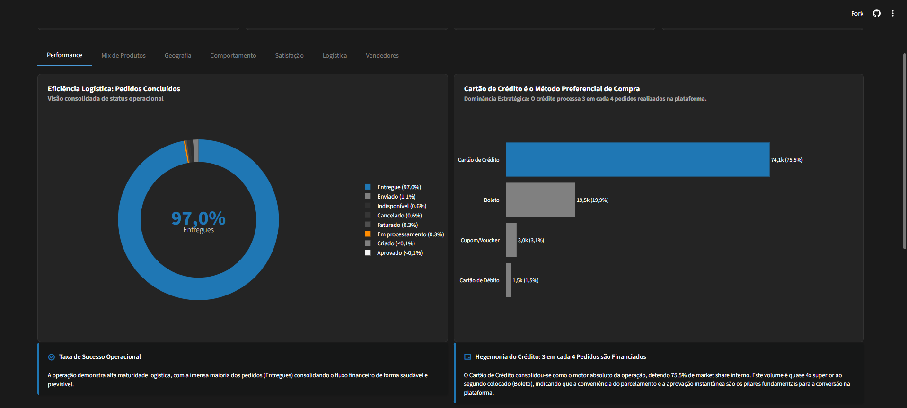
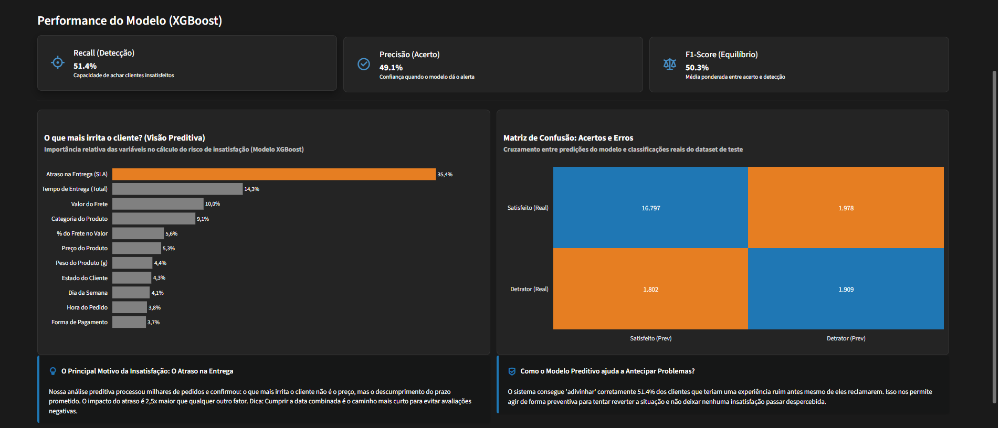
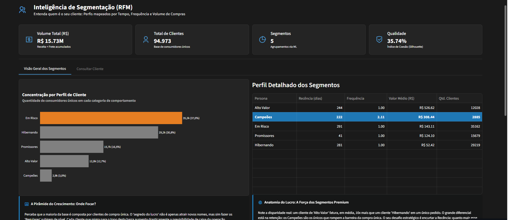
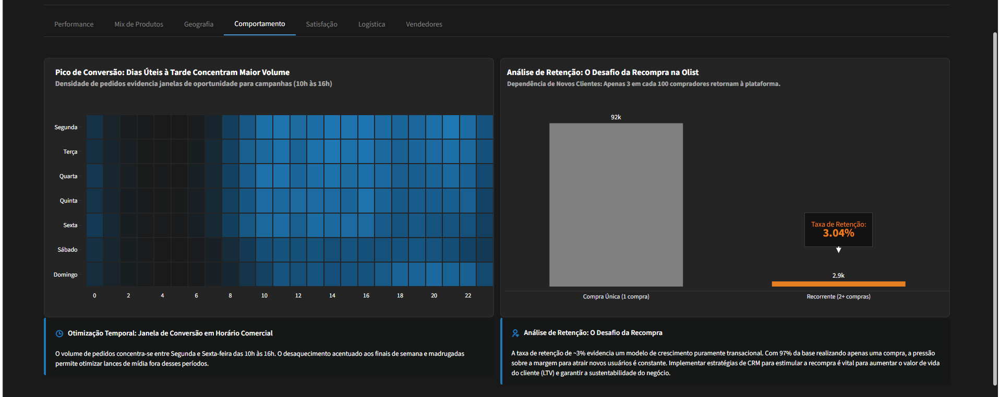

# 📊 Olist Intelligence Dashboard 2.1
**Versão:** `v2.1.0` | **Status:** `Produção (Finalizado)` | **Design:** `Senior Executive` | **Framework:** `Streamlit`

[](https://www.python.org/downloads/release/python-3110/)
[](https://streamlit.io)
[](https://duckdb.org/)
[](https://scikit-learn.org/)

> **A plataforma definitiva de Advanced Analytics para o ecossistema Olist.** 
> Projetada para transformar dados brutos em decisões estratégicas de alto impacto, esta versão 2.0 consolida engenharia de dados robusta, modelos preditivos de última geração e segmentação comportamental profunda.

---

## 🏛️ Arquitetura Analítica (End-to-End)

A solução está estruturada em quatro pilares fundamentais, cada um focado em uma camada de maturidade analítica:

1.  **Engenharia de Performance (Core)**: 
    *   Pipeline ETL modular utilizando **DuckDB** para processamento analítico ultra-rápido.
    *   Armazenamento em formato **Parquet** (Lakehouse local), garantindo latência quase zero no carregamento.
2.  **Dashboard Executivo (`dashboard/`)**:
    *   Interface minimalista focada no **Data-Ink Ratio**, eliminando distrações visuais.
    *   Navegação por Abas Estratégicas: *Exploratória, Diagnóstico, Preditiva e Segmentação*.
3.  **Machine Learning Hub (`ml/`)**:
    *   **Análise Preditiva**: Modelo XGBoost para previsão de satisfação e risco operacional.
    *   **Segmentação RFM**: Clusterização K-Means para mapeamento de personas (Campeões, Em Risco, etc.).
4.  **UX & Performance Analytics**:
    *   Uso intensivo de `@st.cache_data` e `@st.fragment` para uma experiência de usuário fluida e sem interrupções (Zero Rerun Lag).

---
 
 ## 📸 Galeria do Dashboard
 
 | | |
 | :---: | :---: |
 |  |  |
 |  |  |
 
 ---

## 📁 Estrutura do Ecossistema (Senior Standard)

```text
projeto_Olist_EDA/
├── assets/                  # Galeria de Screenshots e Documentação Visual
├── dashboard/               # Interface de Consumo Executivo
│   ├── main.py              # Entrypoint da Aplicação (Layout & Navegação)
│   ├── components/          # Módulos Visuais e Lógica de Abas
│   └── utils/               # Helpers de UI (Design System)
├── ml/                      # Camada de Ciência de Dados & Modelos
│   ├── models/              # Artefatos Binários (.pkl) dos Modelos Treinados
│   ├── reports/             # Métricas de Performance e Profile dos Clusters
│   └── trainer/             # Pipeline de Treinamento e Feature Engineering
├── data/                    # Lakehouse Local (Base Processada)
├── notebooks/               # Estudos de Exploração e Prototipagem
├── etl.py                   # Motor de Engenharia de Dados (DuckDB + Pandas)
├── requirements.txt         # Stack Tecnológica Completa
└── README.md                # Documentação do Projeto
```

---

## 🧠 Novidades da Versão 2.0 (Highlight)

### 💎 Segmentação RFM + Modelagem Preditiva
Agora o dashboard conta com um motor de segmentação proprietário que agrupa +95k clientes em **6 Personas Estratégicas**. Isso permite que o gestor de CRM identifique instantaneamente:
*   **Campeões**: Clientes de alta recorrência e alto ticket.
*   **Em Risco**: Clientes valiosos que não compram há muito tempo.
*   **Hibernando**: Clientes que realizaram apenas uma compra e sumiram.

### 🛡️ Diagnóstico de Culpabilidade
Uma nova engine analítica na aba de "Diagnóstico" que separa atrasos causados pelo **Vendedor** daqueles causados pelo **Operador Logístico**, permitindo auditorias precisas.

---

## 🚀 Deployment Local

1.  **Configurar Ambiente**: `pip install -r requirements.txt`
2.  **Processar Lakehouse**: `python etl.py`
3.  **Habilitar Modelos (Opcional)**: Execute os scripts em `ml/trainer/` para gerar novos modelos.
4.  **Executar Dashboard**: `streamlit run dashboard/main.py`

---

*Desenvolvido com foco na conexão entre Engenharia de Dados, Advanced Analytics e Business Intelligence Strategy.*

